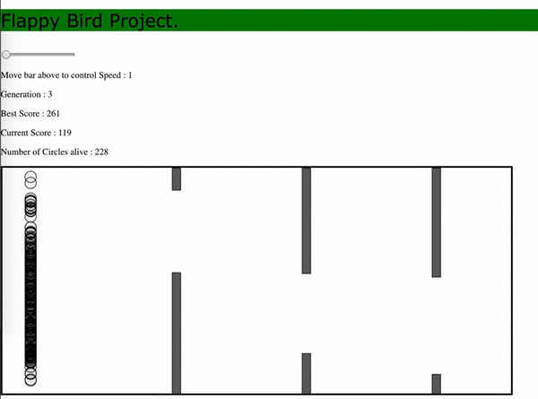

# Flappy Bird using Neuroevolution

[Flappy Bird](https://en.wikipedia.org/wiki/Flappy_Bird) project, where the A.I. trains to get the maximum score. [Neuroevolution](https://en.wikipedia.org/wiki/Neuroevolution) is used, Where each new generation is produced by stochastically removing less desired solutions, and introducing small random changes (Mutations). It is inspired by [Biological Evolution.](https://en.wikipedia.org/wiki/Evolution)

Forgive my lack of better animations, the code perform best when the graphics are minimal.

### Prerequisites

I ran it in google chrome, but any browser will do. 

## Installation

These instructions will get you a copy of the project up and running on your local machine. 

1. Download and unzip [this entire repository from GitHub](https://github.com/suhail511/project003), either interactively, or by entering the following in your Terminal.
    ```bash
    git clone https://github.com/suhail511/project003
    ```
2. Navigate into the top directory of the repo on your machine
    ```bash
    cd project003
    ```
## Running

Open the ```bash index.html ``` file on your browser. Use this to open in Chrome.

```bash
    open -a "Google Chrome" index.html
```

You should see the following in your browser.



The A.I. is trying to get the best score possible, trying to clear the objectives. You can increase the speed of the simulation with the bar in the first line.

### Results

The initial movement is completly random. The Neuroevolutionary Algorithm selects the circles with best score with a higher probability for the next generation. New generation created has small mutations in them, this omproves the performance, generation after generation. 
After the algorithm has learned well (10-20 generations), you should see the performance improve a lot.


## Authors

* **Suhail Ahamed**

## Acknowledgments

* [Daniel Shiffman of the Coding train channel](https://www.youtube.com/user/shiffman)

